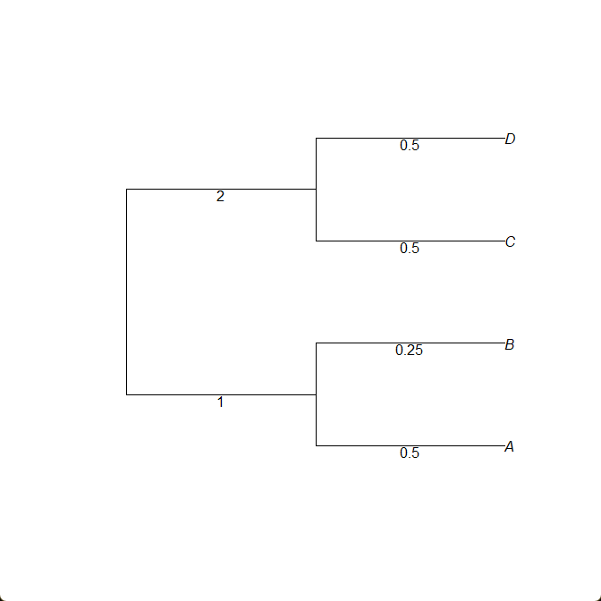

# Estimating a pairwise distance matrix

Two methods for estimating pairwise distance matrices are implemented in InPhyNet.jl: [`calculateAGID`](@ref) and [`calculateAGIC`](@ref). These correspond to **A**verage **G**ene-tree **I**nternode **D**istance/**C**ount. The former (distance) averages the distance by branch length between each pair of taxa across all gene trees, while the latter (count) averages the number of internal nodes in each gene tree separate each pair of taxa across all gene trees.

For example, the internode *distance* between taxa $A$ and $C$ below is $4$, while the internode *count* between them is $2$ (the root is not counted).



For this walkthrough, we will use the AGID metric:

```julia
using InPhyNet, PhyloNetworks, SNaQ

est_gts = load_inphynet_example_gts();
D, namelist = calculateAGID(est_gts);
```
