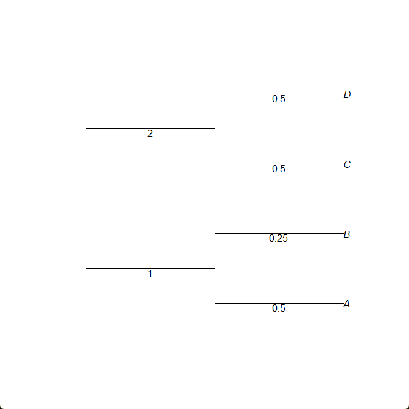

# Estimating a pairwise distance matrix

Two methods for estimating pairwise distance matrices are implemented in InPhyNet.jl: [`calculateAGID`](@ref) and [`calculateAGIC`](@ref). These correspond to **A**verage **G**ene-tree **I**nternode **D**istance/**C**ount. The former (distance) averages the distance by branch length between each pair of taxa across all gene trees, while the latter (count) averages the number of internal nodes in each gene tree separate each pair of taxa across all gene trees.

For example, the internode *distance* between taxa $A$ and $C$ below is $4$, while the internode *count* between them is $2$ (the root is not counted).



For this walkthrough, we will use the AGID metric:

```julia
using InPhyNet, PhyloNetworks, SNaQ

est_gts = load_inphynet_example_gts();
D, namelist = calculateAGID(est_gts);
```

## Mapping alleles to species

When inferring species networks with multiple alleles, we often want to combine the information from the alleles and infer the species networks with the species as the tips, rather than the alleles. [SNaQ provides such functionality when inferring networks](https://juliaphylo.github.io/SNaQ.jl/stable/man/multiplealleles/), and we provide such functionality when computing the pairwise distance matrix to match. To use this functionality, you need to define a `Dict` mapping the names of alleles to their species names, then provide this `Dict` as input to `calculateAGID` or `calculateAGIC`.

In this `Dict`, the left-hand side of each pair (in this case A1, A2, B1, B2, B3, C1, D) should match the names of the leaves in the *gene trees*, and the right-hand side (in this case A, A, B, B, B, C, D) should match the names of the leaves in the *input networks*. If this is not the case, errors may occur.

Below is an example where species A has two alleles, species B has 3 alleles, and species C and D have one allele each. The species C allele does not match the speices name, but the species D allele does.

```julia
speciesmap = Dict(
	"A1" => "A",
	"A2" => "A",
	"B1" => "B",
	"B2" => "B",
	"B3" => "B",
	"C1" => "C",
	"D"  => "D"
)
calculateAGID(genetrees, species_map=speciesmap)
```
