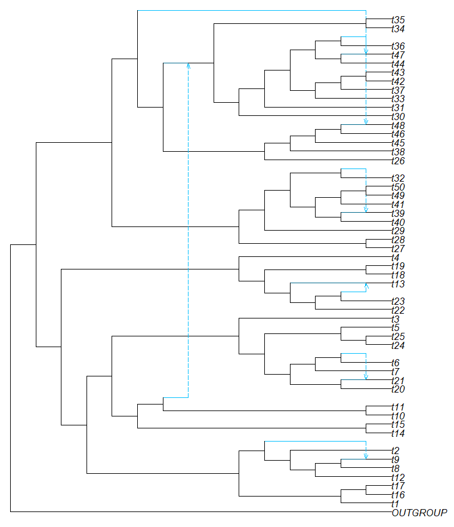

# Constructing the full network

Finally, putting the full network together with InPhyNet is simple:

```julia
species_net = inphynet(D, snaq_networks, namelist)
```

Our example has an outgroup taxa, so we can root the network at that outgroup.

```julia
rootatnode!(species_net, "OUTGROUP")
```

Now, we can use [PhyloPlots.jl](https://github.com/JuliaPhylo/PhyloPlots.jl) to plot the species network.

```julia
using PhyloPlots
plot(species_network);
```



