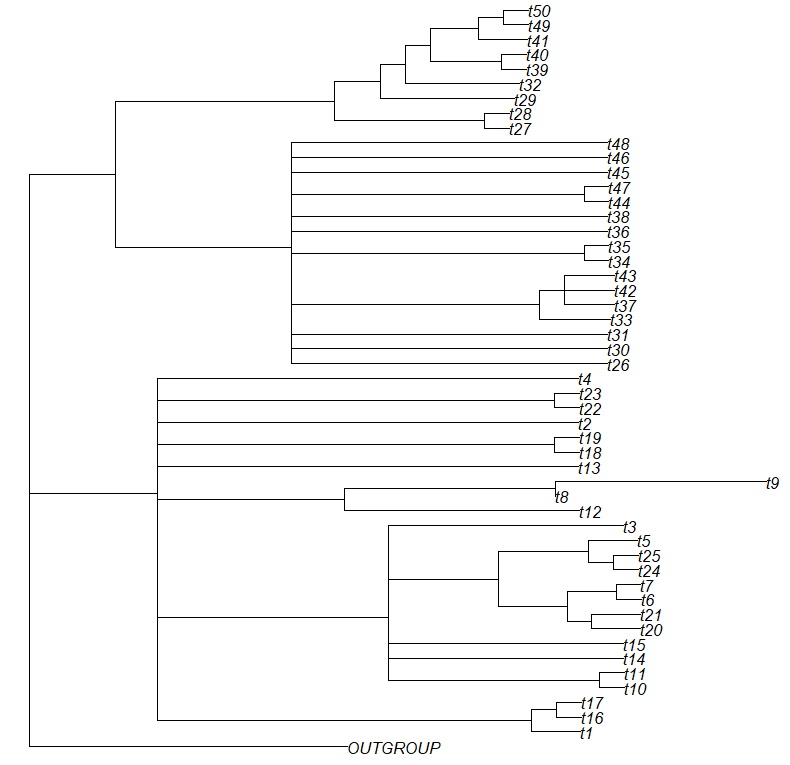
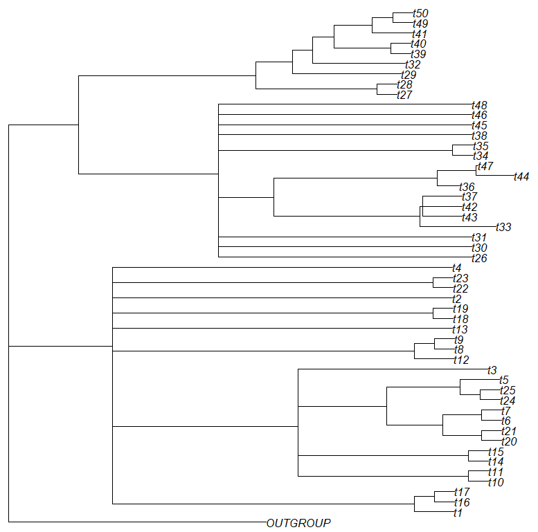

# Choosing your subsets

For thorough analyses, careful subset selection is important. InPhyNet cannot infer instances of reticulate evolution between its input networks, so several taxa from clades where reticulate evolution is likely to have occurred should appear together in at least one subset. To this end, we recommend first performing analyses with software like [TINNiK](https://cran.r-project.org/web/packages/MSCquartets/vignettes/TINNIK.html) to identify these areas. We provide an example of how this could be done below.

Here, we take a naive approach and simply perform [centroid edge decomposition](https://pmc.ncbi.nlm.nih.gov/articles/PMC6705769/#:~:text=The%20clustering%20used%20in,each%20subset.&text=from%20the%20previous%20iteration%29%2C,each%20subset.&text=the%20two%20parts%20have,each%20subset.&text=each%20subtree%20until%20there,each%20subset.) on a species tree inferred by InPhyNet without any constraint networks (this is equivalent to Neighbor-Joining). Centroid edge decomposition is a recursive process that splits a "guide tree" in half at a single edge such that the two halves are of equal size. Then, this process is done recursively on the resulting trees until each subtree contains at most some predefined number of taxa.

This requires us to specify a maximum subset size–for this walkthrough we will use $8$. In practice we recommend that you use the highest number such that you can still infer networks in a reasonable amount of time with your preferred network inference software. We use $8$ here so that all of the walkthrough can be completed quickly.

Additionally, we specify a minimum subset size of $5$ because that is the smallest set of data that SNaQ can infer a network on.

```julia
nj_tre = inphynet(D, namelist)
subsets = centroid_edge_decomposition(nj_tre, 5, 8)
```

# Using TINNiK

TINNiK is implemented in the [MSCquartets](https://cran.r-project.org/web/packages/MSCquartets/vignettes/TINNIK.html) package in [R](https://www.r-project.org/about.html), so we need to save our estimated gene trees to a file so that they can be opened in R.

```julia
# In Julia
writemultinewick(est_gts, "example_gts.tre")
```

The runtime of TINNIK quickly climbs with the number of taxa being evaluated. With our 51 taxa example it may take several minutes for results to come back. In the case of many more taxa it could take several hours, days, or even longer. In such cases, TINNIK may not be the preferred tool for conducting this portion of the analyses. If it is still preferred, though, it may be necessary to break the set of all taxa into smaller subsets each of which has its own tree of blobs inferred.

```R
# In R
library(MSCquartets)

gts <- read.tree(file = "example_gts.tre")
results <- TINNIK(gts, alpha=0.05, beta=0.95, plot=FALSE)
tob <- results$ToB

plot(tob)
```


When using TINNIK, it is important to explore multiple values of $\alpha$ and $\beta$ before assessing any results. Fortunately, evaluating subsequent values for $\alpha$ and $\beta$ is very fast because we can re-use data from the original analysis.

>[!NOTE]
More information on $\alpha$ and $\beta$ parameters, including best practices recommended by the authors of TINNIK, can be found in [this TINNIK vignette](https://cran.r-project.org/web/packages/MSCquartets/vignettes/TINNIK.html), which we highly recommend reading before using TINNIK.

```R
results2 <- TINNIK(results$pTable, alpha=0.01, beta=0.99, plot=FALSE)
tob2 <- results2$ToB

plot(tob2)
```



From these results, we would ideally split these taxa three subsets:

1. Containing the taxa with tree-like relationships at the top of the figure along with the outgroup
2. The first large block of taxa represented by a multifurcation (t48, t46, t45, ..., t30, t26)
3. The second such large block of taxa (t4, t23, t22, ..., t17, t16, t1)

For this walkthrough, such subsets would lead to very long inference times, so we will forgo this step and instead utilize the subsets generated above.

>[!NOTE]
In practice, if such subsets are too large to be feasible with your preferred method of network inference, then concessions must be made in some manner, likely either by splitting these blocks into smaller subsets or by utilizing a faster but less accurate method of network inference.


